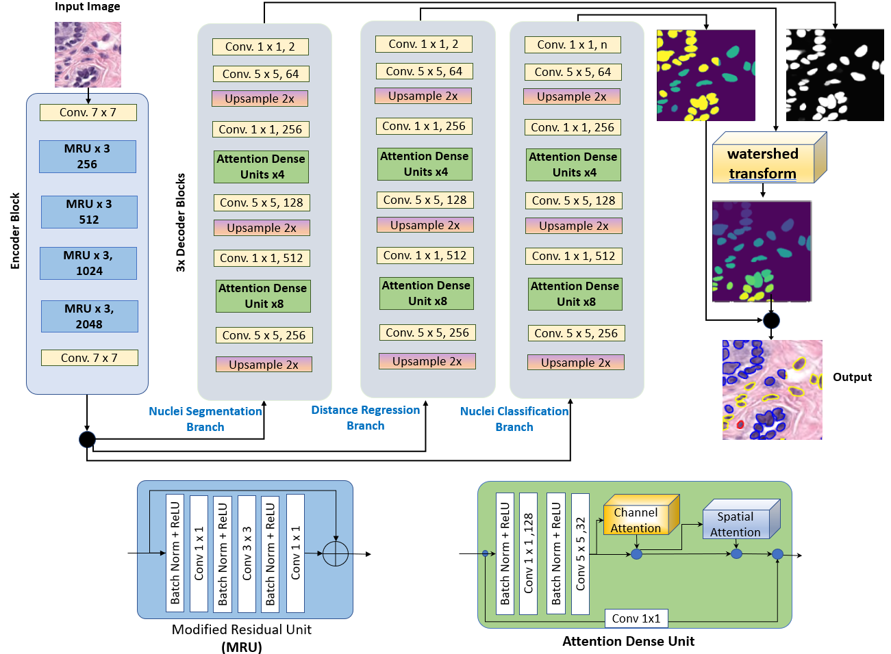
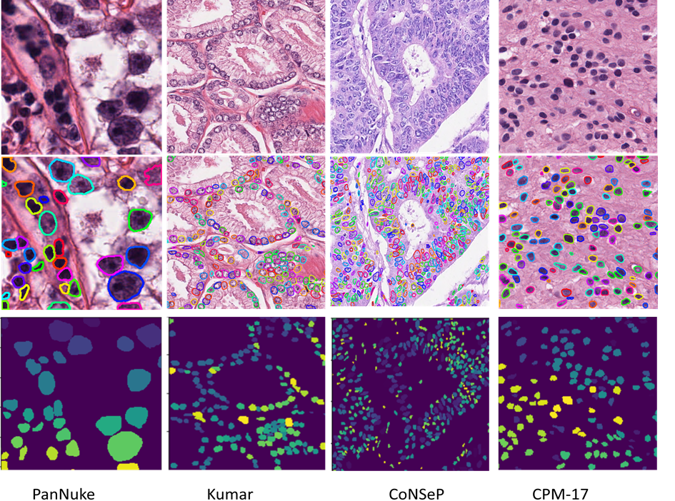

# DRCA-Net: Nuclei Instance Segmentation and Type Classification in Digitized Histology Images

DRCA-net(distance regression and classification with attention) is a convolutional neural network developed using tensorflow and tensorpack. In this work i perform nuclei instance segmentation and type classification in parallel using an end-to-end trainable multi-branch convolutional neural network which uses attention mechanism for  feature refinment and higher accuracy.We have experimented our network with four diffenet H&E stained multi-tissue datasets.

## DRCA-Net model ; 3 branch acrchitecture along with attention units design and placement.

**Overall architecture of the model showcasing base shared feature encoder and three different attention incorporated branches**
<br/>



## Visualization of network predictions overlayed on respective images
<br/>

**Classification results on PanNuke dataset**
<br/>


**Instance Segmentation results on the four datasets that we have used**
<br/>


## Steps to run this model
<br/>

**Install all dependecies mentioned in the requirements text file**
```
pip install -r requirements.txt
```

**Dataset download links**

The project is configured to run PanNuke dataset

CoNSeP (https://warwick.ac.uk/fac/sci/dcs/research/tia/data/hovernet/) <br />

Kumar,TNBC,CPM-15 and CPM-17 (https://drive.google.com/open?id=1l55cv3DuY-f7-JotDN7N5nbNnjbLWchK).  <br />

PanNuke dataset (https://warwick.ac.uk/fac/sci/dcs/research/tia/data/pannuke/) <br/>


**Preprocessing steps before training**
<br/>


Use the python scripts in the `panNukePrecprocess/` folder to process panNuke dataset. make necessary directory configurations. <br/>
Create patches by running the file  `extract_patches/` , provide the directory paths in the script file.<br/>

**Training**
<br/>

Change hypermeters in the `opt/hover.py` file, select batch size according to your available GPU memmory.<br/>

In `config.py` file , enter paths of extracted training and validation patches.<br/>

run file `train.py` using command `python train.py --gpu="0,1"` select gpus according to your specific scnenerio.<br/>

**Inference and performance calculation**

run file `infer.py` after training , post process your model output by running script `process.py` <br/>

finally setup directories in the `compute_stats.py` file and run this file by providing mode to `--mode` flag either `instance` or `type` <br/>

For PanNuke classification calculations use file `convert.py` to create `.mat` format ground-truth masks necessary for calculation prediction performance.


